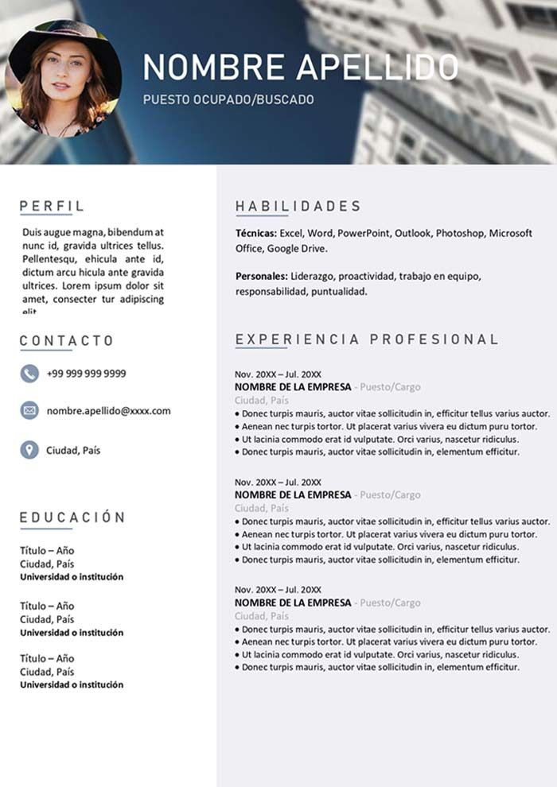

1.  Constuye un archivo HTML que tenga un contenido central dividido en 2 bloques, en cada bloque incluye dos listas posicionada una frente a la otra, cada elemento de la lista debe tener un tamaño y tipo de letra diferente, los bordes de cada sección deben ser rojos (opcional) y el fondo debe ser verde.
2.  Crea tu hoja de vida, a partir de lo visto en la clase 1 y 2, el diseño es completamente libre pero debes tener en cuenta los siguientes requisitos:
    - Incluir tu fotografía 
    - Utiliza por lo menos dos columnas
    - Utiliza al menos dos tamaños de fuente y colores de fuente distintos.
    - Debes incluir enlaces usando links a tus redes sociales (Facebook, linkeIn, etc)
    - Incluir la imagen de fondo es opcional

A continuación encuentrás un ejemplo:

Trabajar en parejas 
 - Juliana y Roberto
 - David y Andrés
 - Daniel Romero y Daniel Cañon
