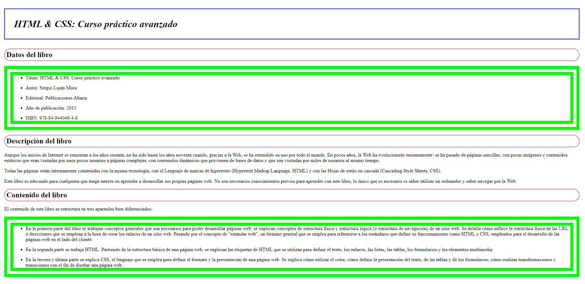
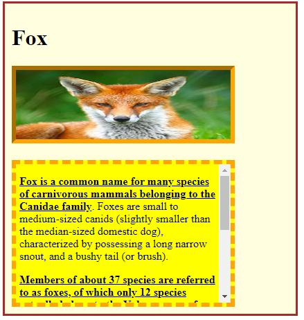
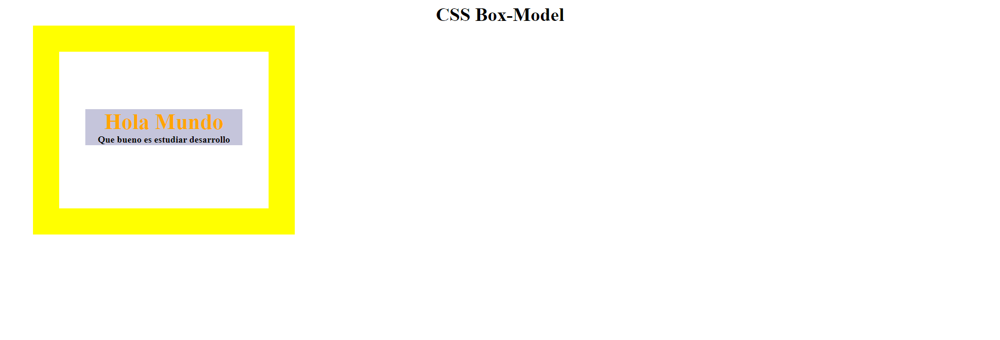

# Tareas del módulo

Las tareas de los módulos son pensadas para profundizar en los temas expuestos e interiorizar más el conocimiento.

## Tareas

En la generación de estilos hay infinitas maneras de llegar a un mismo resultado, así es que el punto de estas tareas es que pongas en práctica el conocimiento y generes estructuras utilizadas frecuentemente en páginas web de producción, no es necesario tener la respuesta 100% igual a la propuesta.

1. Dada la siguiente estructura de página intenta replicarla con base en la estructura del html de primeraTarea.html
   - 
2. Dada la siguiente imagen y el html segundaTarea.html, haciendo uso del box model y selectors llega a una solución lo más parecida posible a la imagen presentada
   - 
4. Dada la siguiente imagen, haciendo uso de Box Model intenta replicarla con base en la estructura HTML dada en el archivo tercerTarea.html
   - 

