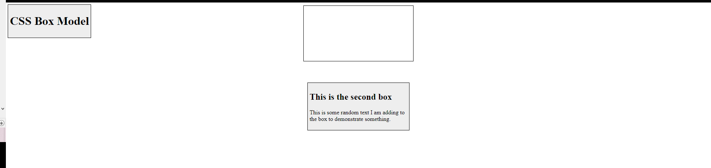
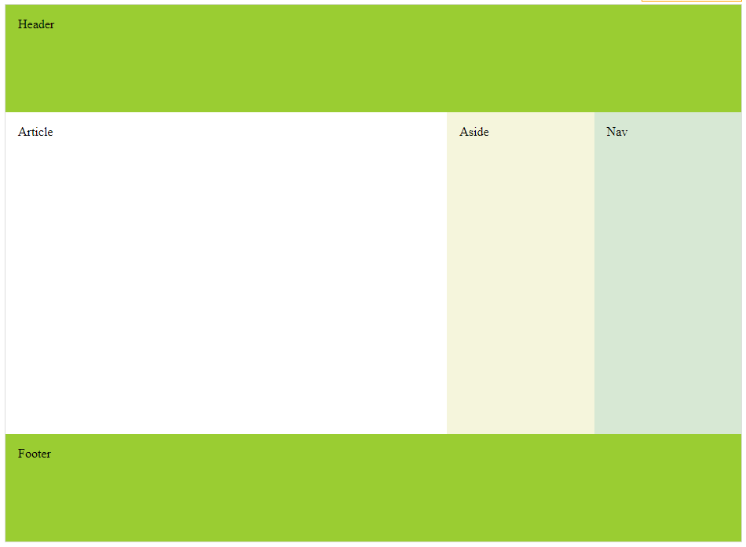
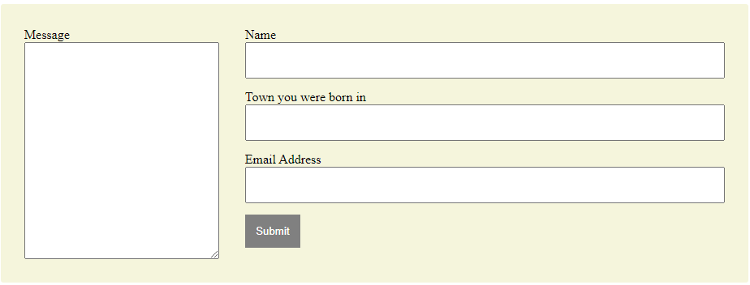

# Tareas del modulo

Las tareas de los módulos son pensadas para profundizar en los temas expuestos e interiorizar más el conocimiento.

## Tareas

Aplica los estilos dados según las condiciones especificadas de manera de llegar a la imagen ejemplo, recuerda que en cuanto a estilos hay infinitas maneras de llegar a la misma solución:

1. Haciendo uso del HTML de terceraTarea.html y los conocimientos en position relative y absolute llega aplica los estilos necesarios para replicar lo máximo posible la siguiente distribución 

   - 

2. Ahora usando el html de segundaTarea.html y conceptos de Flexbox y de disposiciones de páginas web llega desarrolla la siguiente estructura

   - 

3. Usando el html de terceraTarea.html y los conceptos de Flexbox y de formularios crea algo parecido al siguiente formulario

   - 
