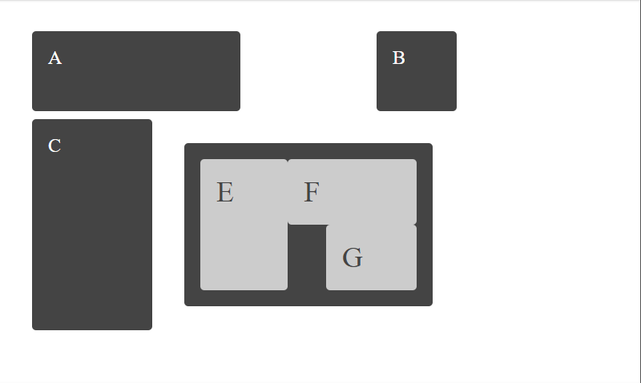

# Tareas del modulo

Las tareas de los módulos son pensadas para profundizar en los temas expuestos e interiorizar más el conocimiento.

## Tareas

Aplica los estilos dados según las condiciones especificadas de manera de llegar a la imagen ejemplo, recuerda que en cuanto a estilos hay infinitas maneras de llegar a la misma solución:

1. Dado el HTML de la primera tarea aplica los estilos css grid para convertirlo en la siguiente imagen. - 

2. Dado el HTML segundaTarea.html haciendo uso de las herramientas aprendidas de CSS grid, llega a la siguiente imagen

   - 

3. Tarea final de Grid, utilizando CSS grid desarrolla la siguiente layout

   - 

4. Utilizando media queries y flexbox genera un menu responsive que se vea como el siguiente:
   [mediaqueries_homework.webm](./../resources/mediaqueries_homework.webm)
   
[mediaqueries_homework.webm](https://github.com/kambcode/FullStack_Javascript_G1_2023_06_26/assets/137812574/ec4e36d3-d37a-4cda-bad7-f868d595f106)

   Recuerda usar el paton de diseño `mobile first` (Primero genera el comportamiento para mobile y depues si ajustalo para pantallas mas grandes). Además utiliza 720px como breakpoint
